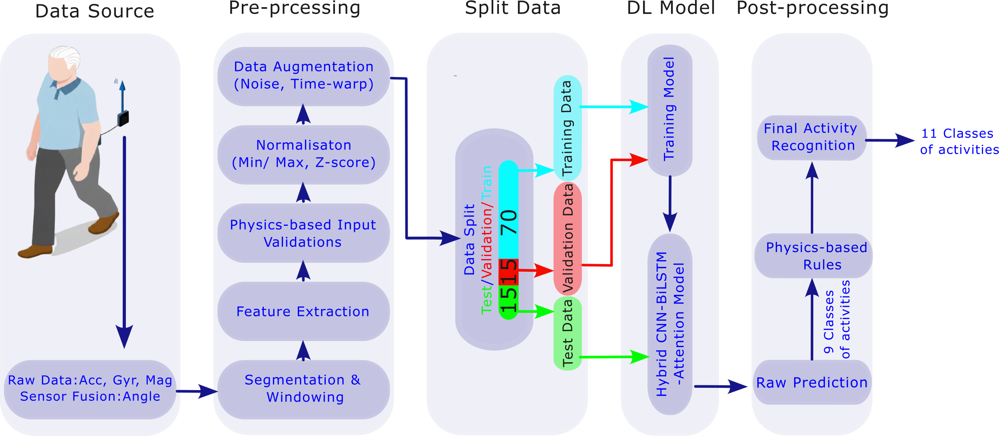
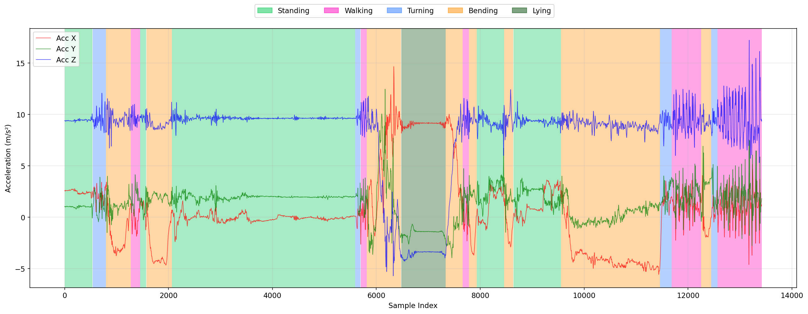
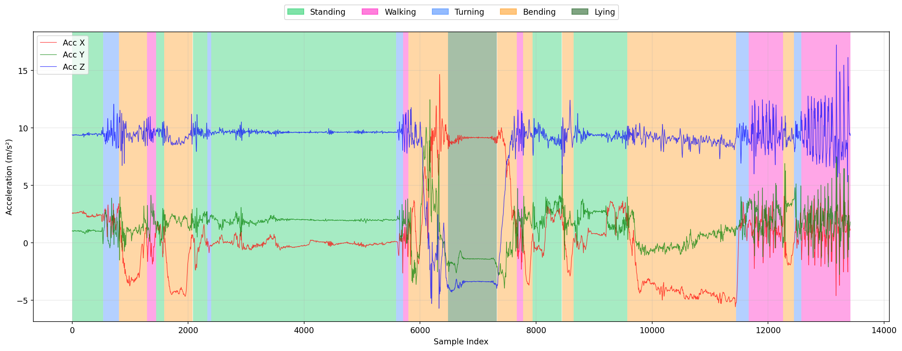

# The Fall's Overture
### Activity recognition pipeline for IMU-based fall analysis

---

This repository is a placeholder for the code, trained model, and supporting
materials associated with the manuscript
*"The Fall's Overture: Reconstructing Real-World Fall Scenarios in
Home-dwelling Older Adults"* (currently submitted for peer review).

The work was developed at the University of Exeter, Department of Public
Health and Sport Sciences.

The repository will be updated with the full analysis code, trained model,
and supporting materials after the related manuscript has been published.
Early access can be provided on request.

## Example output

The figures below illustrate the output of the activity-recognition pipeline
on a representative laboratory IMU recording: the model's predicted activity
timeline (top), and the ground-truth annotations for the same recording
(bottom). Activities are coloured according to the nine-class scheme
described in the Methods.

### Predicted timeline

### Ground-truth timeline

## Contact

**Dr Naser Taleshi** — n.taleshi@exeter.ac.uk
Lecturer in Data Science and Biomechanics, University of Exeter, UK
